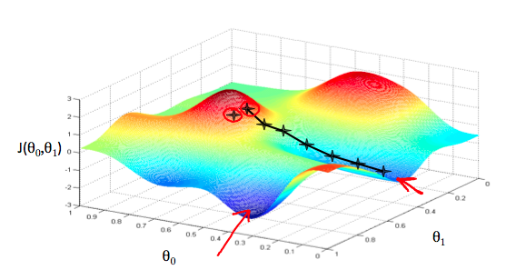

# Machine Learning Stanford - Andrew Ng

## Week 1 - Linear regression
**Cost function**
- Objective is to find value of $\theta_0,\theta_1$, in order to minimize cost function $J$
  - $\theta_0,\theta_1, ..., \theta_n$ are coefficients to our equation e.g. $\theta_0 + \theta_1 x + ... + \theta_n x_n= y$
- In an ideal world, $\theta_0,\theta_1$ are chosen so that $h_{\theta}(x)$ - hypothesis - is close to $y$ for the training example $(x,y)$ 

#### Squared error function (or mean squared error)

$J(\theta_0,\theta_1) = \frac{1}{2m}\sum_{i=1}^m (\hat{y}_i - y_i)^2$

$h_{\theta}(x_i) = \theta_0 + \theta_{1}x$

$\hat{y}_i = h_{\theta}(x_i)$ 

$J(\theta_0,\theta_1) = \frac{1}{2m}\sum_{i=1}^m (h_{\theta}(x_i) - y_i)^2$

- Cost function with only one parameter is an inverted parable, with lowest point where J is minimised.

- With 2 parameters, it's a 3d surface plot or a contour plot.

### Gradient descent

- Algorithm to minimise function J
  - Start with some values of $\theta_0,\theta_1$ 
    - e.g $\theta_0 = 0,\theta_1 = 0$
  - Keep changing it to reduce $J(\theta_0,\theta_1)$ until find minimum
- Also applies to functions with more parameters
- Can have local optimums
  - Not in linear regression, it is a convex function:
  - 

Repeat until convergence:

$\theta_j := \theta_j - \alpha \frac{\partial}{\partial\theta_j}J(\theta_0,\theta_1)$

- $:=$ is *assignment* operator
- $\alpha$ is *learning rate*, how big the steps are (distance between stars in the chart above)
  - if too small, algorithm will be slow
  - if too big, can overshoot minimum, failing to converge or even diverge
  - 
- direction of travel is determined by the partial derivative
- *Simultaneously update* $\theta_0$ and $\theta_1$
  - $temp0 := \theta_0 - \alpha \frac{\partial}{\partial\theta_0}J(\theta_0,\theta_1)$
  - $temp1 := \theta_1 - \alpha \frac{\partial}{\partial\theta_1}J(\theta_0,\theta_1)$
  - $\theta_0 := temp0$
  - $\theta_1 := temp1$
- Partial derivative:
  - looks at slope of tangent to $\theta_1$
  - 
- When local minimum reached, slope = 0, derivative = 0, no change in $\theta_1$
  - When approaching local minimum, gradient descent will automatically take smaller steps

### Calculating partial derivative term in gradient descent formula

$\frac{\partial}{\partial\theta_j}J(\theta_0,\theta_1) = \frac{\partial}{\partial\theta_j} \frac{1}{2m}\sum_{i=1}^m (h_{\theta}(x_i) - y_i)^2 = \frac{\partial}{\partial\theta_j} \frac{1}{2m}\sum_{i=1}^m (\theta_0 + \theta_1 x - y_i)^2$

$\theta_0 j = 0 : \frac{\partial}{\partial\theta_j} J(\theta_0,\theta_1) = \frac{1}{m}\sum_{i=1}^m (h_{\theta}(x_i) - y_i)$

$\theta_1 j = 1 : \frac{\partial}{\partial\theta_j} J(\theta_0,\theta_1) = \frac{1}{m}\sum_{i=1}^m (h_{\theta}(x_i) - y_i) x_i$

Therefore algorithm will be:

- Repeat until convergence {
$\theta_0 := \theta_0 - \alpha \frac{1}{m}\sum_{i=1}^m (h_{\theta}(x_i) - y_i)$
$\theta_1 := \theta_1 - \alpha \frac{1}{m}\sum_{i=1}^m (h_{\theta}(x_i) - y_i) x_i$
}

# Linear Algebra review

**Matrix**: 2d array of numbers
- Dimension: number of rows x number of columns (e.g. 2 by 3 or 2x3)
- $A_{ij} =$ "$i,j$ entry" is the $i^{th}$ row and the $j^{th}$ column 

**Vector**: special case of matrix, with only 1 column ($n \times  1$ matrix)
- $y_{i} =$ "$i$ entry" is the $i^{th}$ element
  - can be 1-indexed (more common in math) or 0-indexed (more common in programming)
  - course uses 1-indexed vectors

**Scalar**: single value, not a vector or matrix

### Addition

- Add each element
- Cannot add different sizes

### Scalar multiplication

- Multiply each element by scalar

### Matrix vector multiplication

- Multiply matrix row with elements of vector, and add them up
  - 
- Will result in Matrix-rows dimension vector
- Matrix column size has to match vector size (how many rows)

### Matrix matrix multiplication

- Multiply first matrix to every column of second matrix (as a vector), then make new matrix with those vectors resulting, as columns
- Columns of first matrix must be equal of rows of second matrix
- Size is rows_first_matrix x columns_second_matrix

#### Properties of matrix multiplication

- Not commutative (unless B is identity matrix)
  - $A \times B \neq B \times A$
- Associative property is valid
  - $A \times B \times C$
    - same if $(A \times B) \times C$ or $A \times (B \times C)$

Identity matrix:
- $I$ or $I_{n \times n}$
- $M = \begin{bmatrix}
       1 & 0 & 0 \\[0.3em]
       0 & 1 & 0\\[0.3em]
       0 & 0 & 1 \\[0.3em]
       \end{bmatrix}$
- $A \times I = I \times A = A$

#### Inverse and transpose

Matrix inverse:

- e.g. $3(3^{-1}) = 1$, 
    - $3^{-1}$ is $\frac{1}{3}$
- $AA^{-1} = A^{-1}A = I$
  - matrix that multiplied to our matrix, results in identity matrix
  - all square matrices $m \times m$ size, have inverse
- Matrices with no inverse are called "singular" or "degenerate"

Matrix transpose:

- First row becomes first column, etc
- $A$ is $m \times n$ matrix, $A^T$ is $n \times m$, $B_{ij} = A_{ji}$
  

