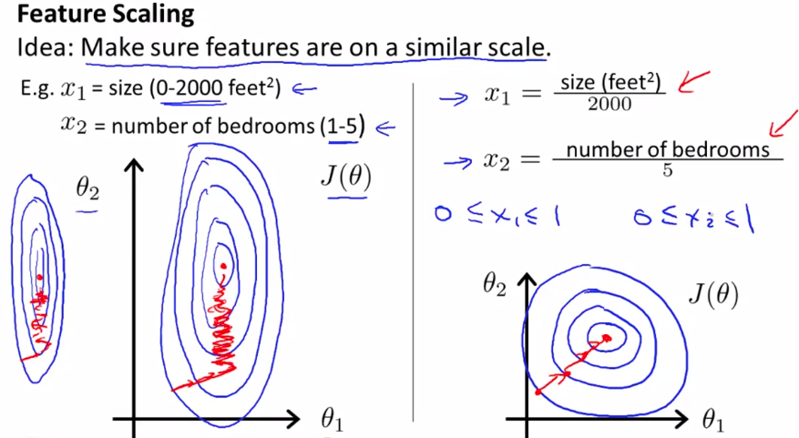
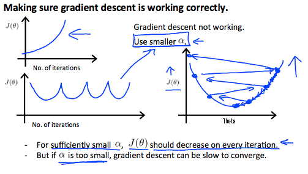
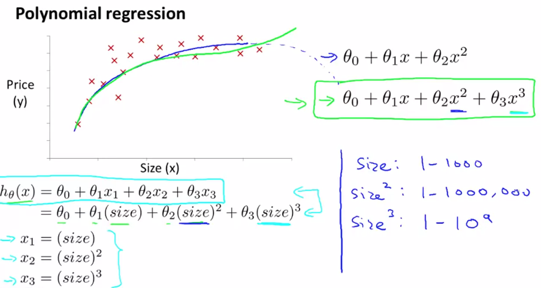
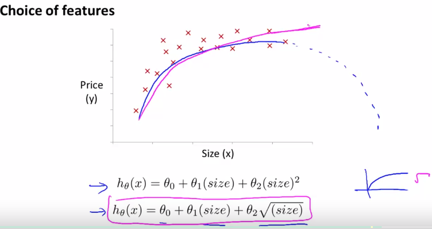
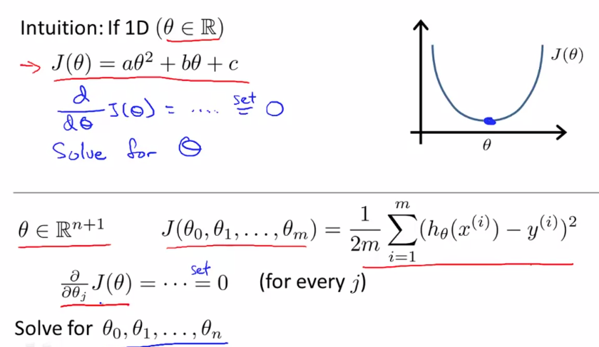

# Machine Learning Stanford - Andrew Ng

## Week 2 - Multivariate Linear regression

- Similar to linear regression, but has multiple features (variables)
- One row of features translates to a vector
- Hypotesis:
  - $h_\theta (x)= \theta_0 + \theta_1 x_1 + \theta_2 x_2 + \theta_3 x_3 + \theta_4 x_4 + ... + \theta_n x_n$
  - For convenience, $x_0 = 1$
  - $X = \begin{bmatrix}
       x_0 \\[0.3em]
       x_1 \\[0.3em]
       x_2 \\[0.3em]
       ... \\[0.3em]
       x_n \\[0.3em]
       \end{bmatrix}$
  - $\theta = \begin{bmatrix}
       \theta_0 \\[0.3em]
       \theta_1 \\[0.3em]
       \theta_2 \\[0.3em]
       ...      \\[0.3em]
       \theta_n \\[0.3em]
       \end{bmatrix}$
  - $h_\theta (x)= \theta^T x = \begin{bmatrix}
       \theta_0 & \theta_1 & \theta_2 & \theta_3\\[0.3em]
       \end{bmatrix} \times \begin{bmatrix}
       x_0 \\[0.3em]
       x_1 \\[0.3em]
       x_2 \\[0.3em]
       ... \\[0.3em]
       x_n \\[0.3em]
       \end{bmatrix} $
- Parameters:
  - $\theta_0 , \theta_1 , \theta_2  , \theta_3 ... \theta_n$
- Cost function:
  - $J(\theta) = \frac{1}{2m}\sum_{i=1}^m (h_{\theta}(x^{(i)}) - y^{(i)})^2$
- Gradient descent
  - Repeat until convergence {
$\theta_j := \theta_j - \alpha \frac{1}{m} J(\theta) = \theta_j - \alpha \frac{1}{m} \sum_{i=1}^m (h_{\theta}(x^{(i)}) - y^{(i)})x_{j}^{(i)}$
}
  - Simultaneously for every $j = 0 ,..., n$

### Feature scaling

- Gradient descent works better if features are on a similar scale
- 
- Get every features into approximately $-1 \leq x_i \leq 1$
- Can divide by maximum value, or use mean normalisation
- Mean normalisation:
  - Replace $x_i$ with $x_i - \mu_i$ (average value of $x_i$), then divide by $s_i$ (range of $x_i$), or SD can be used
  - $x_i := \frac{x_i - \mu_i}{s_i}$

### How to choose learning rate $\alpha$

- $J(\theta)$ should decrease after every iteration
- Automatic convergence test:
  - Declare convergence if $J(\theta)$ decreases by less than $\epsilon =$ e.g $10^{-3}$ in one iteration
- if $J(\theta)$ increases with each iteration, choose smaller $\alpha$ (but if too small, can be slow to converge)
- 
- try range of values $... 0.001, 0.01, 0.1, 1...$

### Polynomial regression

- Quadratic or cubic regression might fit data better
- Feature scaling is more important because features will have wider ranges
- 
- 
- There are algorithm to automatically choose features

### Normal equation - computing parameters analitically

To minimise function, have derivative of function = 0
- 
- Create **matrix of features X** (with column $x_0$ = 1) size $m + (n + 1)$ - m examples, n features, and **vector y**
- $\theta = (X^TX)^{-1}X^Ty$
  - in octave *pinv* to have inverse of matrix
- Feature scaling is not necessary
- No need to choose $\alpha$, no iteration, but much slower for large datasets $O(n^3)$, usually for $n \gt 10000$
- Does not work for more sophisticated ML algorithms
- If $X^TX$ is **non-invertible**? Use *pinv*, not *inv*
  - Common causes:
  - Reduntant features (linearly dependent)
    - e.g. $x_1$ = size in feet, $x_2$ = size in m
  - Too many features ($m \leq n$)
    - Delete some features or use regularisation