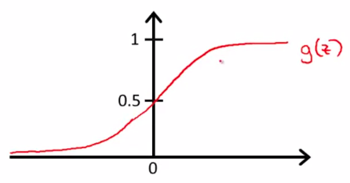
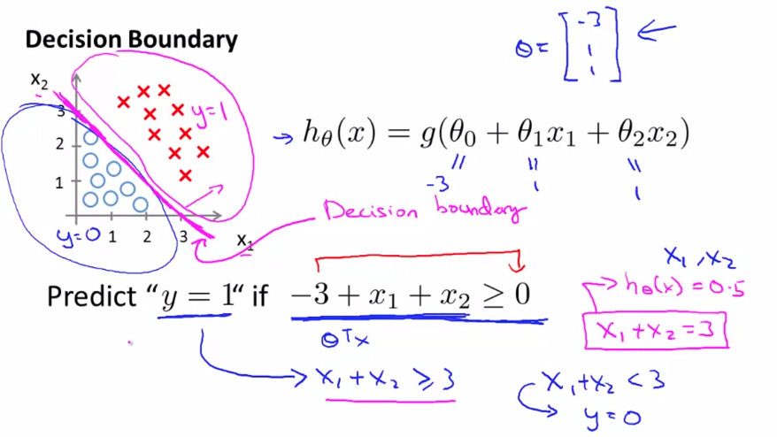
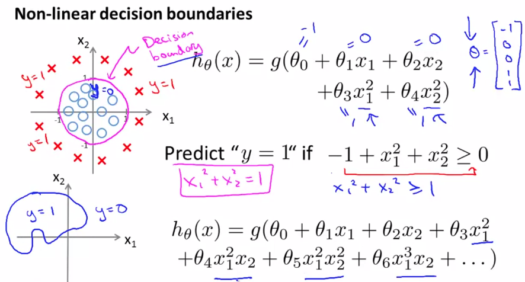
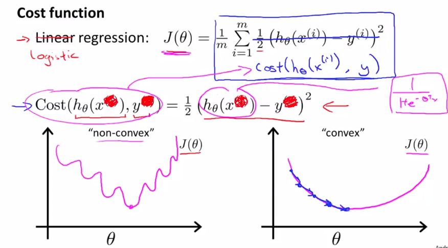

# Machine Learning Stanford - Andrew Ng

## Week 3 - Classification and Representation

- Classify into classes:
  - e.g. $y \in \{0, 1\}$, $y$ is either 0 or 1 (binary classification)
- Threshold classifier e.g. 0.5 if 2 categories equally split
  - Linear regression won't work, outliers would skew results

### Logistic regression
- $0 \leq h_\theta(x) \leq 1$
- Always between 0 and 1
- $h_\theta(x) = g(\theta^Tx)$
- Sigmoid or logistic function: $g(z) = \frac{1}{1+e^{-z}}$ 
- $h_\theta(x) = \frac{1}{1+e^{-\theta^Tx}}$
  - Approaches 1 or 0 at infinite
- 

### Interpretation of hypotesis output

- $h_\theta(x)$ - estimated probability that y = 1 on input x
  - e.g. $h_\theta(x) = 0.7$ means 70% probability
  - $h_\theta(x) = p(y=1|x;\theta)$ is probability that $y = 1$, given $x$, parameterized by $\theta$ 

### Decision boundary

- Predict $y$ based on $h_\theta(x)$, e.g. 1 if $\geq 0.5$, 0 if $< 0.5$
- In function above, $g(z) \geq 0.5$ when $z \geq 0.5$
  - $z \geq 0.5$ if $\theta^Tx \geq 0$
- Decision boundary is based on $\theta^Tx$
- 
- Can be non-linear
- 
- Only depends on parameters, not on training set

### Cost function

- Training set: $\{(x^{(1)},y^{(1)}), (x^{(2)},y^{(2)}),...,(x^{(m)},y^{(m)})\}$
- m examples: $x \in \begin{bmatrix}
       x_0 \\[0.3em]
       x_1 \\[0.3em]
       ... \\[0.3em]
       x_m \\[0.3em]
       \end{bmatrix}$
       $x_0 =1,y \in \{0,1\}$
- $h_\theta(x) = \frac{1}{1+e^{-\theta^Tx}}$
- How to choose parameters $\theta$?
- $Cost(h_\theta x,y) = \frac{1}{2}(h_\theta x - y)^2$
  - Would produce a non-convex function if cost calculated of logistic (sigmoid) function - it's non linear
  - gradient descent on example on the left has many local optima, need different cost function as below
  - 
  
**Logistic regression cost function**
  - $Cost(h_\theta x,y) = $
    - $-\log(h_\theta (x))$ if $y = 1$
    - $-\log(1 - h_\theta (x))$ if $y = 0$
  - If $y=1$ and $h_\theta(x)=1$, $cost = 0$, perfectly predicted
  - If $y=1$ and $h_\theta(x)=0$, $cost = \infty$, algorithm penalized by a large cost
  -   
  -   
  - $y = 0$ or $1$ always
  - Expanded above system: $Cost(h_\theta (x),y) = -y\log(h_\theta(x)-(1-y)\log(1-h_\theta(x)))$
    - Cost $= -(1-y)\log(1-h_\theta(x)))$ if y = 0
    - Cost $= -y\log(h_\theta(x))$ if y = 1
- Cost function is therefore: **$J(\theta) = -\frac{1}{m}[\sum_{i=1}^m y^{(i)}log h_\theta(x^{(i)})+(1-y^{(i)})log(1-h_\theta(x^{(i)}))]$**
- Based on principle of maximum likelihood estimation
- To fit parameters $\theta$, minimise function J
- To make a prediction given new $x$:
  - $h_\theta (x) = \frac{1}{1+e^{-\theta^T x}}$
  - Interpreted as $p(y=1|x;\theta)$, probability of $y = 1$, given $x$ parameterized by $\theta$

**Gradient descent**
- Repeat $\theta_j := \theta_j - \alpha \frac{\partial}{\partial \theta_j}J(\theta)$
- Solving partial derivative: $\theta_j := \theta_j - \alpha\sum_{i=1}^m (h_\theta(x^{(i)}) - y^{(i)})x_j^{(i)}$
  - Same as linear regression, but $h_\theta(x^{(i)})$ is different
- Can update $\theta$ with a loop, or vectorized operation
  - Vectorized: $\theta := \theta - \alpha \frac{1}{m}\sum^m_{i=1} [(h_\theta(x^{(i)})-y^{(i)})x^{(i)}]$
  - $\theta := \theta -  \frac{\alpha}{m}X^T(g(X\theta)-y)$
- Apply feature scaling to logistic regression (same as linear regression)

**Optimization algorithm**
- There are more sophisticated algorithms than gradient descent:
- e.g. conjugate gradient, BFGS, L-BFGS
  - Advantages:
    - No need to manually pick $\alpha$
    - Often faster than gradient descent
  - Disadvantages:
    - More complex

**Multiclass classification**
- y has more than 2 values
- 
- Train a logistic regression classifier for each class vs all other classes, then to make a prediction pick classifier that maximises probability:
-     

**Overfitting**
- Algorithm does well on training data, but sub-optimal for new data
-   
-   
- How to address overfitting:
  - Reduce number of features (manually select, or use model selection algorithm)
  - Apply regularization: keep all features, but reduce magnitude of $\theta$

**Regularization**
- Have small values for parameters $\theta$, that makes the hypothesis "simpler" and algorithm less prone to overfitting
  -   
- cannot know which parameters needs to be reduced
- add regularization term to cost function, to shrink all parameters
- convention to start from $\theta_1$
- $J(\theta) = \frac{1}{2m}\sum_{i=1}^m (h_\theta(x^{(i)})-y^{(i)})^2+\lambda\sum_{j=1}^n\theta_j^2$
- term on the right is regularization term
- $\lambda$ is regularization parameter, control goal between fitting data well, and keeping parameters small (avoid overfitting)

**Regularized linear regression**
- Gradient descent: $\theta_j := \theta_j(1-\alpha\frac{\lambda}{m})-\alpha\frac{1}{m}\sum_{i=1}^m(h_\theta(x^{(i)})-y^{(i)})x_j^{(i)}$
- $(1-\alpha\frac{\lambda}{m})$ is < 1, reduces value of $\theta_j$
- Normal equation method:
  - 

