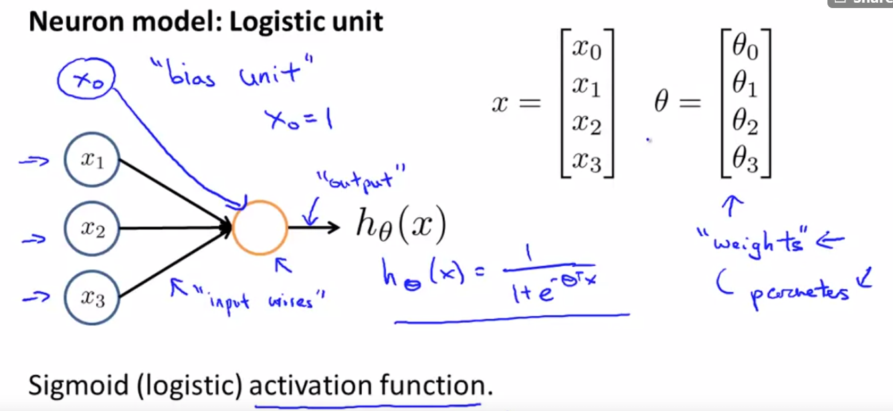
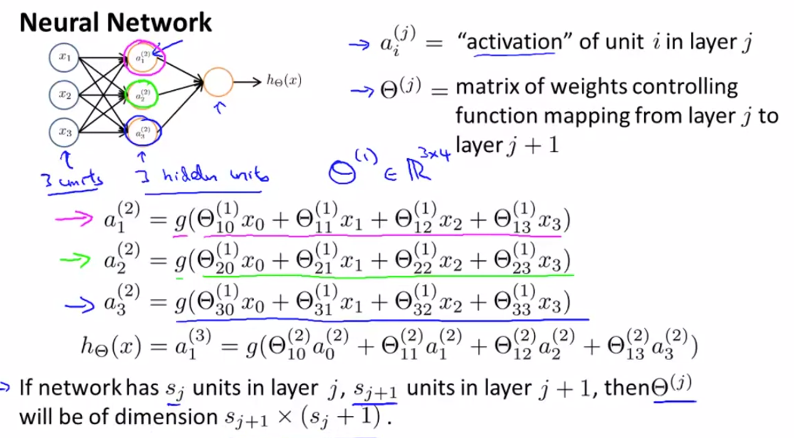
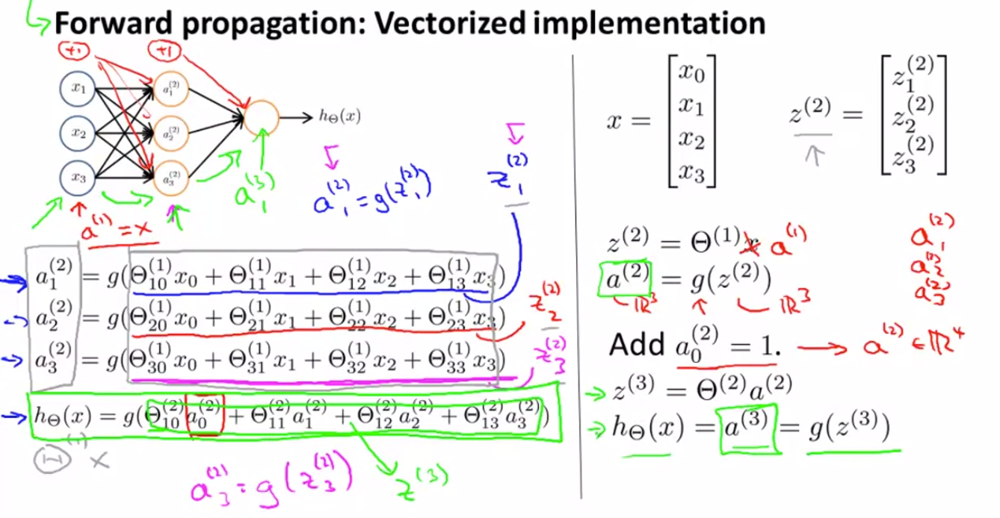

# Machine Learning Stanford - Andrew Ng

## Week 4 - Neural Networks: Representation

### Non-linear Hypotheses

- Difficult to use previous algorithms on dataset with high number of features
  - Risk of overfitting
  - Computational intensive
  - e.g. for 100 features, to include polynomial to 2nd degree = 5000 features $O(n^2)/2$

**Neural Networks**

- one learning algorithm hypothesis - neuro rewiring experiments
  - e.g. auditory cortex rewired to eyes, learn to see
  - any part of the brain is able to interpret input, there is one brain learning algorithm

**Model Representation**

- Neuron model: logistic unit
  - receives input from input wires -> computation -> output
  - sigmoid (logistic) activation function
  - theta can be called weights instead of parameters
  -  
  - first layer called **input layer**
  - final layer called **output layer**
  - layers in between **hidden layers**
  - $a_i^{(j)}$ = activation of unit $i$ in layer $j$
  - $\theta^{(j)}$ = matrix of weights controlling function mapping from layer $j$ to layer $j+1$
  - computation example:
    -   
    - dimension is size of current layer x size of previous layer + 1
    - Example: If layer 1 has 2 input nodes and layer 2 has 4 activation nodes. Dimension is 4x3

**Vectorized implementation**

-   
- $a_1^{(2)} = g(\theta_{10}^{(1)}x_0+\theta_{11}^{(1)}x_1+\theta_{12}^{(1)}x_2+\theta_{13}^{(1)}x_3)$
- $z_1^{(2)} = \theta^{(1)} a^{(1)} = \theta_{10}^{(1)}x_0+\theta_{11}^{(1)}x_1+\theta_{12}^{(1)}x_2+\theta_{13}^{(1)}x_3 $
- $a^{(2)} = g(z^{(2)}))$
- Need to add bias unit $a_0^{(2)}=1$ 
- a is a 4 dimensional vector
- $h_\theta(x) = a^{(3)} = g(z^{(3)})$
- $g(x)$ is sigmoid activation function
- **Forward propagation**: start with activation of input units, activate each layer sequentially from their input